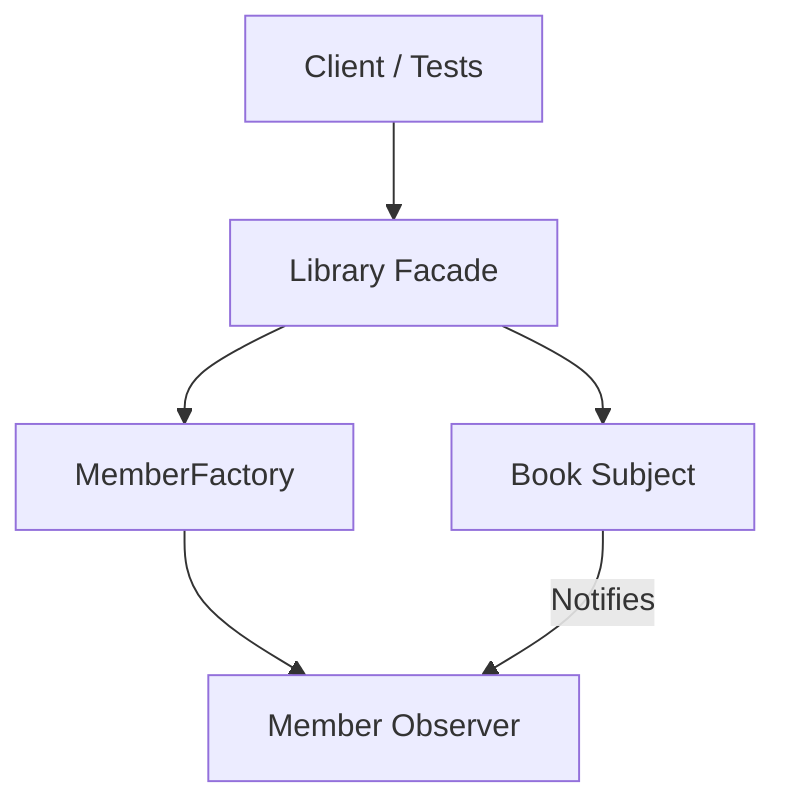

# OOP-Based Library Reservation System

An Object-Oriented Library Reservation System built in **TypeScript** demonstrating key software design patterns (**Factory**, **Observer**, and **Facade**), strict borrowing limits, FIFO waitlists, overdue fine calculations, and unit testing with **Jest**.

---

## 🌟 Architecture & Design Patterns

The system is structured around four primary classes:



### 1. Factory Pattern (`MemberFactory`)
Provides a static `createMember(type, name)` interface to instantiate specific `Member` subclasses without exposing creation logic:
- **`StandardMember`**: Borrowing limit = **3** books.
- **`StudentMember`**: Borrowing limit = **5** books.
- **`StaffMember`**: Borrowing limit = **10** books.

### 2. Observer Pattern (`Book` & `Member`)
- **`Book` (Subject)**: Maintains an internal waitlist of members. When a reserved book is returned, `notifyObservers()` notifies waitlisted members.
- **`Member` (Observer)**: Implements `update(book)`, printing formatted console notifications:
  `Notification for [Member Name]: The book "[Book Title]" is now available.`

### 3. Facade Pattern (`Library`)
Serves as the central entry point coordinating book management, member registration, reservations, returns, waitlists, and fine calculations.

---

## 📁 Directory Structure

```
/
├── src/
│   ├── Book.ts           # Subject in Observer Pattern (title, author, waitlist)
│   ├── Member.ts         # Observer Interface & Subclasses (Standard, Student, Staff)
│   ├── Library.ts        # Central Facade (addBook, registerMember, reserveBook, etc.)
│   └── MemberFactory.ts  # Factory Pattern for creating Members
├── tests/
│   └── Library.test.ts   # Comprehensive Jest unit test suite
├── .gitignore            # Git exclusion rules
├── jest.config.js        # Jest configuration
├── package.json          # Node dependencies & test script
├── tsconfig.json         # TypeScript compiler configuration
└── README.md             # Project documentation
```

---

## ⚙️ Key System Features

- **Borrowing Limits Enforcement**: Throws `Error("Reservation limit reached.")` if a member attempts to exceed their limit.
- **First-In, First-Out (FIFO) Waitlist**: When a returned book has waitlisted members, the book is automatically assigned to the first waiter who joined the queue.
- **Overdue Fine Calculation**: Calculates fines at a fixed rate of **$0.50 per day overdue**.
- **JSDoc Documentation**: All public methods and classes are fully documented with JSDoc comments.

---

## 🚀 Getting Started

### Prerequisites
- Node.js (v18+)
- npm

### Installation

Clone the repository and install dependencies:

```bash
npm install
```

### Running Tests

Execute the unit test suite with Jest:

```bash
npm test
```

---

## 💻 Usage Example

```typescript
import { Library } from './src/Library';

const library = new Library();

// 1. Add Books
library.addBook('The Hobbit', 'J.R.R. Tolkien');

// 2. Register Members using Factory Pattern
const alice = library.registerMember('Alice', 'student');
const bob = library.registerMember('Bob', 'student');

// 3. Reserve Book
library.reserveBook(alice.id, 'The Hobbit');

// 4. Join Waitlist (if book is already reserved)
library.reserveBook(bob.id, 'The Hobbit');

// 5. Return Book (notifies waitlist and transfers reservation to Bob via FIFO)
library.returnBook('The Hobbit');
// Output: Notification for Bob: The book "The Hobbit" is now available.
```

---

## 🧪 Test Coverage Summary

- ✅ **MemberFactory**: Correct borrowing limits (3, 5, 10).
- ✅ **Limit Enforcement**: Throws exact error `Reservation limit reached.`.
- ✅ **Observer Pattern**: Standard output notification matching contract spec.
- ✅ **FIFO Waitlist**: Automatic transfer to first waiter upon return.
- ✅ **Fine Calculation**: Accurate calculation at $0.50 / day.
- ✅ **JSDoc Verification**: Verified presence of JSDoc on required public methods.
